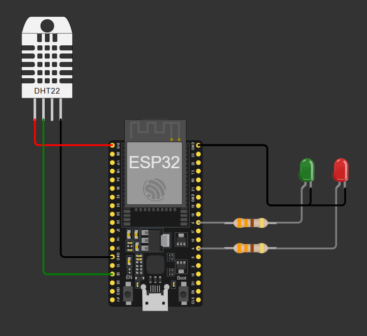

# Proyecto guia "Fundamentos IoT con ESP32"

## Contenido

Este proyecto se basa en la libreria Universal-Arduino-Telegram-Bot, donde desplegaremos un bot en telegram que nos permitira controlar perifericos y obtener los datos de temperatura y humedad de forma actualizada.

## Objetivos

* Resaltar la importancia de los microcontroladores en el IoT.
* Explicar a detalle el uso de perifericos con la ESP32.
* Relacionar conceptos de Wifi en la comunicacion inalambrica.

## Esquematico

<p align="center">
  
</p>

## Despliegue 

Este repositorio se encuentra diseñado para que se ejecute de forma inmediata con VSCode mediante la extension PlatformIO IDE, en caso de no tenerla la puedes agregar en Extensiones.

Y sigue este flujo para poner el proyecto en funcionamiento:

1. Clona el repositorio

```
git clone https://github.com/Cesarq19/intro_esp32.git
```

2. Crea un bot de telegram con BotFather y copia el token del bot.


3. En la carpeta include, debes crear un archivo llamado `credentials.h` que tendra la siguiente estructura:

```
// Wifi credentials
const char *SSID = "your-SSID";
const char *PASSWORD = "your-passwd";
// Telegram credentials
const char *BOT_TOKEN = "your-BOT-TOKEN";
```
